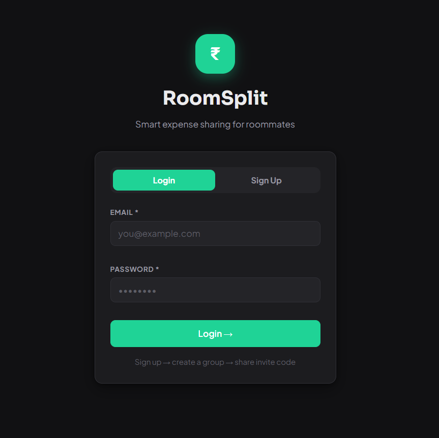
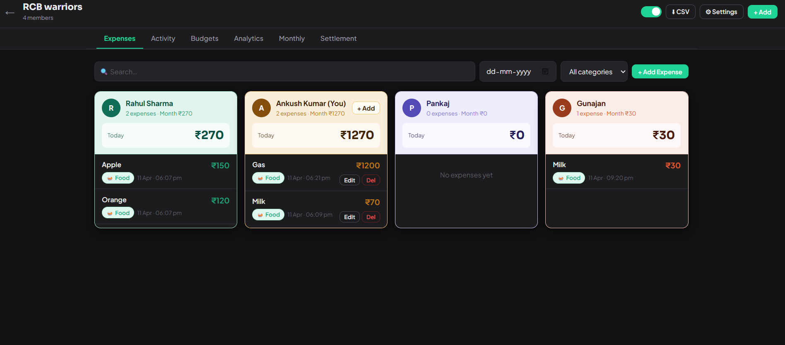
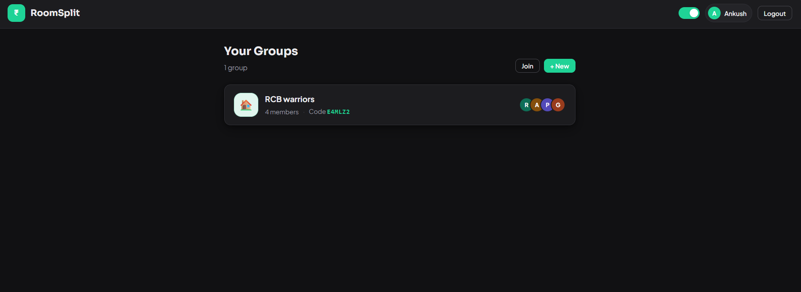
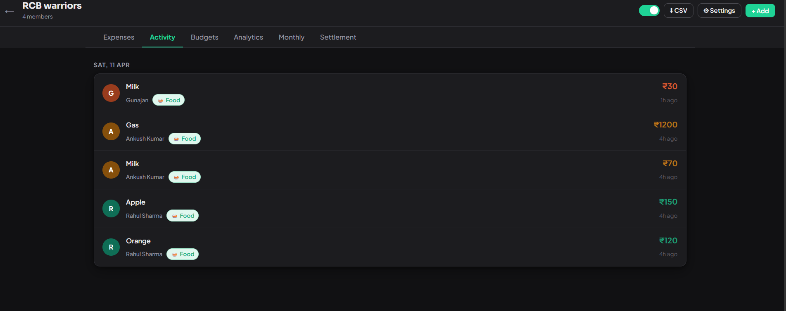
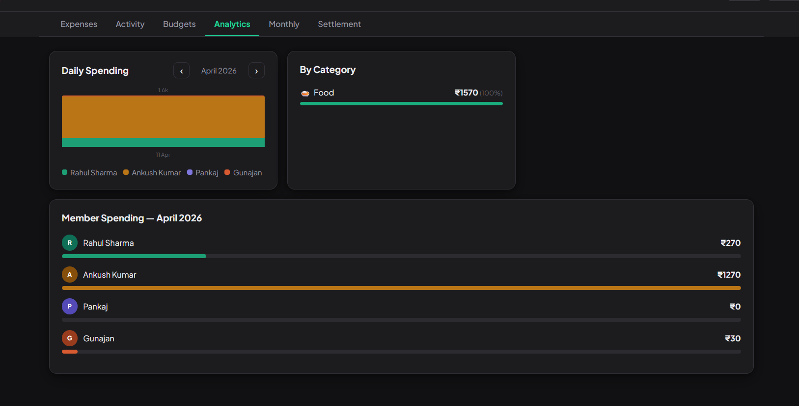
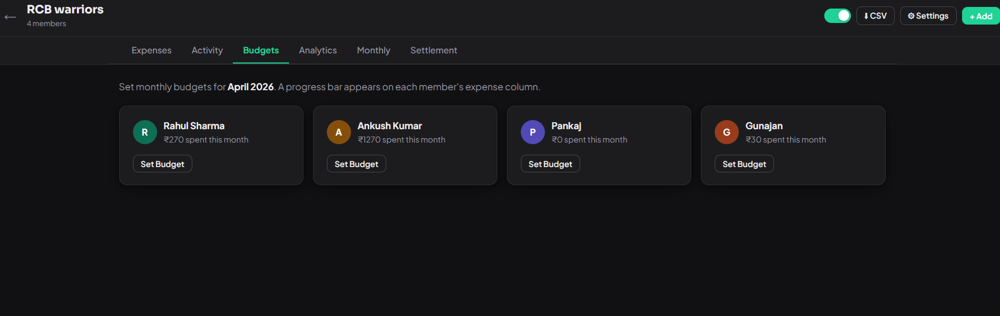
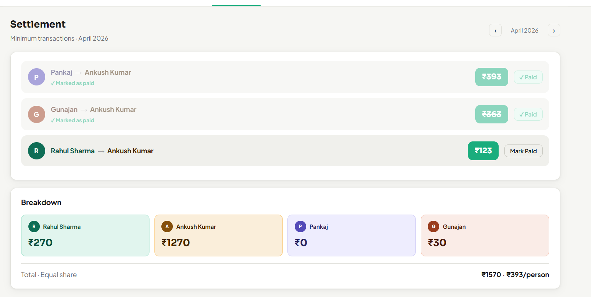

# 💸 RoomSplit

🔗 **Live Demo:** https://roomsplit-roan.vercel.app
🔗 **Backend API:** https://roomsplit-nfte.onrender.com

RoomSplit is a full-stack MERN application that helps roommates easily track, split, and settle shared expenses.

---

## 🚀 Features

* 🔐 User Authentication (JWT)
* 👥 Create & Join Groups
* 💰 Add & Split Expenses
* 📊 Analytics Dashboard
* 📅 Monthly Budgets
* 🔄 Settlement System
* 🌙 Dark Mode
* 📤 CSV Export

---

## 📸 Screenshots










---

## 🛠 Tech Stack

**Frontend**

* React (Vite)
* JavaScript
* CSS

**Backend**

* Node.js
* Express.js

**Database**

* MongoDB Atlas

**Deployment**

* Frontend → Vercel
* Backend → Render

---

## 📂 Project Structure

```bash
roomsplit/
├── backend/
│   ├── server.js
│   ├── config/
│   ├── models/
│   ├── controllers/
│   ├── routes/
│   └── middleware/
│
├── frontend/
│   ├── dist/
│   ├── node_modules/
│   ├── screenshots/
│   │   ├── signup.png
│   │   ├── dashboard.png
│   │   ├── group.png
│   │   ├── activity.png
│   │   ├── analytics.png
│   │   ├── budgets.png
│   │   ├── monthly.png
│   │   └── Settlement.png
│   ├── src/
│   │   ├── controllers/
│   │   ├── model/
│   │   └── views/
│   ├── index.html
│   ├── package.json
│   └── vite.config.js
│
├── .env.example
├── package.json
├── vite.config.js
└── README.md
```

---

## ⚙️ Environment Variables

### Backend (.env)

```env
MONGO_URI=your_mongodb_uri
JWT_SECRET=your_secret
CLIENT_URL=https://roomsplit-roan.vercel.app
```

---

### Frontend (Vercel)

```env
VITE_API_URL=https://roomsplit-nfte.onrender.com
```

---

## 💻 Run Locally

```bash
git clone https://github.com/your-username/roomsplit.git

# Backend
cd backend
npm install
npm run dev

# Frontend
cd frontend
npm install
npm run dev
```

---

## 🧠 Architecture

* MVC Pattern
* `ApiModel.js` → handles all API calls
* Controllers → business logic
* Views → UI layer

---

## 📈 Future Improvements

* 🔔 Notifications
* 📱 Mobile UI improvements
* 📊 Advanced charts
* 🌐 Custom domain

---

## 👨‍💻 Author

**Ankush Kumar**

---

## ⭐ Support

If you like this project, give it a ⭐ on GitHub!
